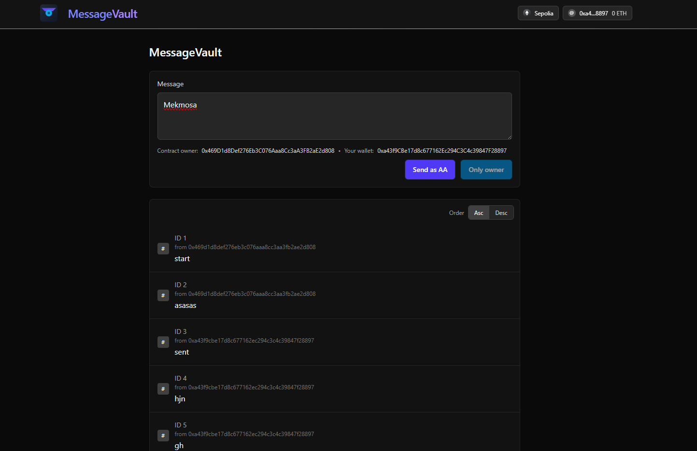
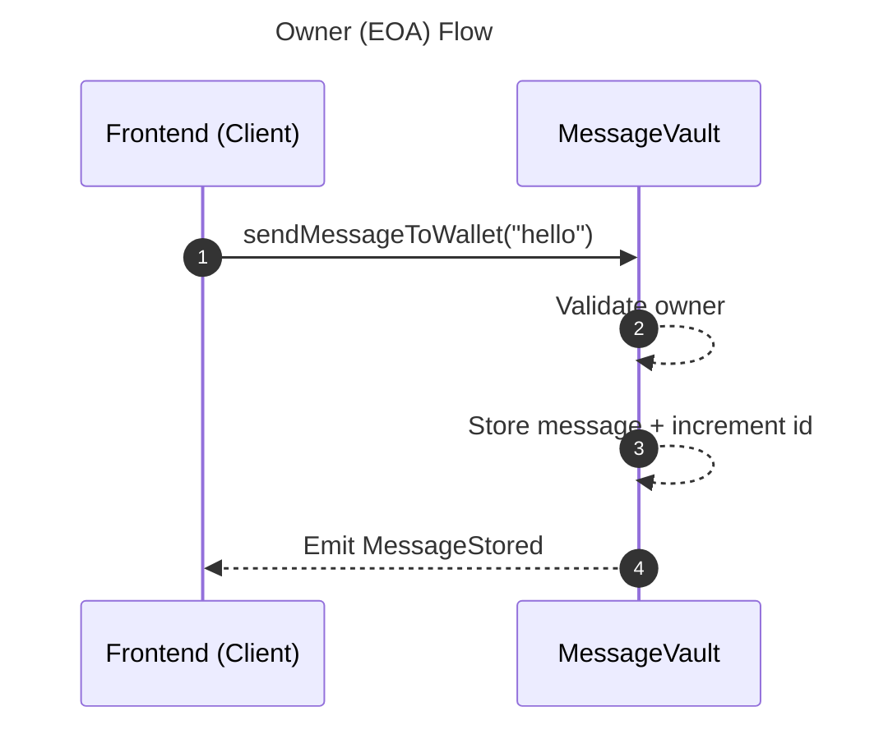
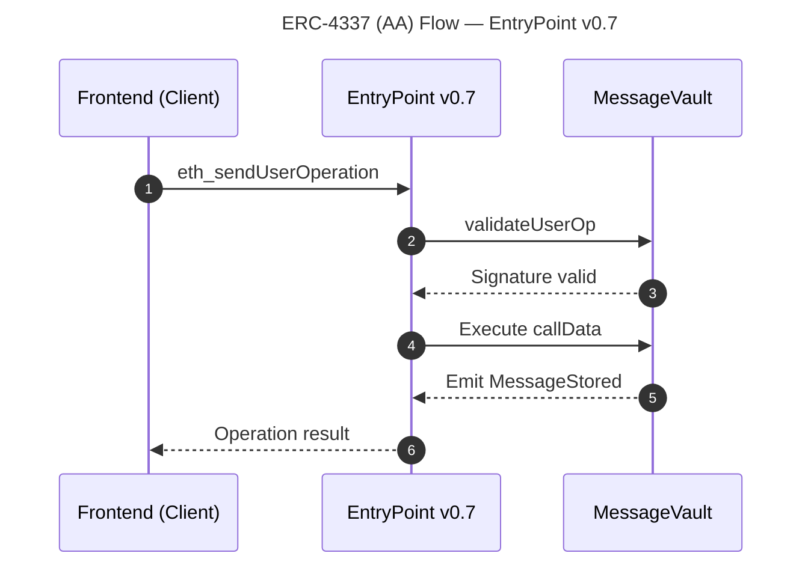
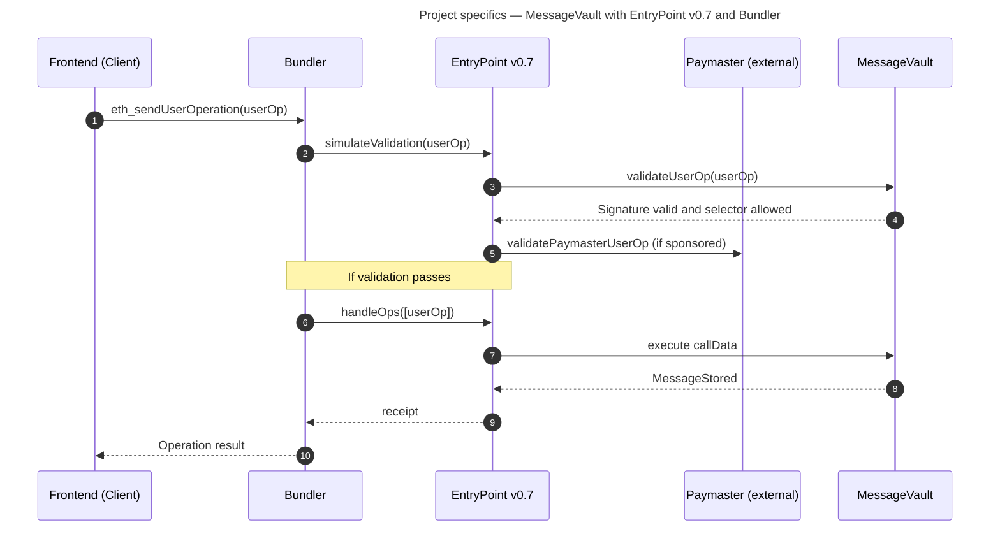
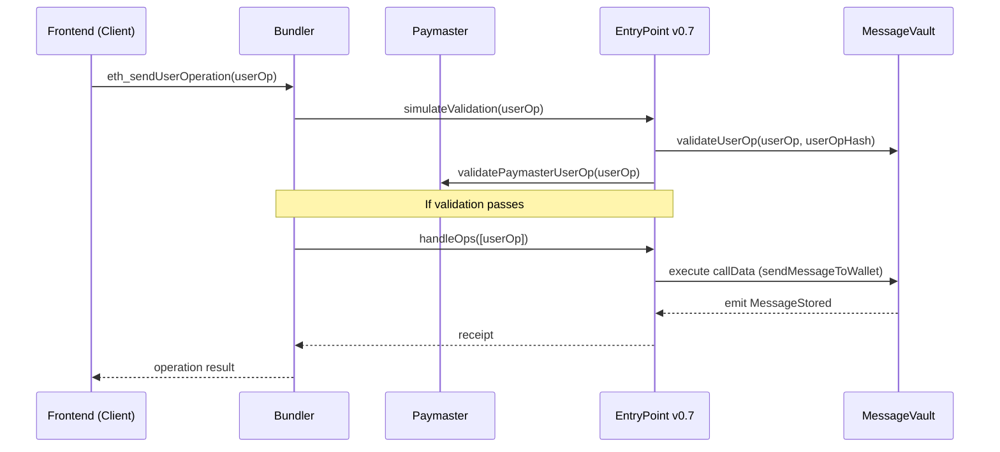

# MessageVault — Subgraph Deployment Guide and References

This document describes how to verify the contract, generate/compile, and deploy the MessageVault subgraph in The Graph Studio, and how to consume it from the frontend. It includes references to the project’s backend and frontend.

See also: [Frontend README](frontend/README.md) · [Backend README](backend/README.md)

## Live Demo

A live demo is available at https://messagevault.casaislabs.com.

Important: This repository does not include or version a local `subgraph/` folder. Manage your Subgraph in The Graph Studio and do not commit `subgraph/`.

## Table of Contents
- [Live Demo](#live-demo)
- [Project Composition & Standards](#project-composition--standards)
  - [Interaction Flow — Owner and ERC-4337](#interaction-flow--owner-and-erc-4337)
  - [Interaction Flow — Bundler & Paymaster](#interaction-flow--bundler--paymaster)
  - [ERC-4337 Components — Bundler & Paymaster](#erc-4337-components--bundler--paymaster)
   - [Bundler](#bundler)
   - [Paymaster](#paymaster)
   - [Project specifics](#project-specifics)
- [TL;DR — Create and Deploy Quickly](#tldr--create-and-deploy-quickly)
- [Requirements](#requirements)
- [Subgraph — Create, Build & Deploy](#subgraph--create-build--deploy)
- [Common Problems](#common-problems)
- [Maintenance](#maintenance)
- Related docs: [Frontend README](frontend/README.md) · [Backend README](backend/README.md)

## Project Composition & Standards

Overview
- Monorepo: `backend` (Hardhat/Ignition + Solidity), `frontend` (Vite/React + Wagmi), and no-versioned `subgraph/` (Studio-first).
- Contract: `MessageVault.sol` implements an ERC-4337 smart account to store and emit messages.
- Tooling: Hardhat v3, `ethers v6`, OpenZeppelin utils, Ignition for deployments, The Graph Studio for indexing.

EVM Standards & Why
- `ERC‑4337 (IAccount, EntryPoint v0.7)`: enables account abstraction so non‑owners can invoke wallet actions via `UserOperation` if they pass signature validation. This allows sponsored gas (Paymaster), session capabilities, and richer UX.
- `EIP‑191 (personal_sign)`: signatures over `userOpHash` used in `validateUserOp` for off‑chain signing and replay‑protected verification.
- `EIP‑1271`: explicitly not implemented in this wallet to keep validation surface small; only EIP‑191 is accepted.
- OpenZeppelin `ECDSA` and `MessageHashUtils`: robust signature handling and message prefixing; `ReentrancyGuard` prevents reentrancy in state‑changing paths.

How the DApp & Contract Work
- Ownership and permissions:
  - `owner` can call wallet functions directly.
  - `EntryPoint` may call on behalf of a validated signer through `validateUserOp` (AA flow).
- Core actions:
  - `sendMessageToWallet(string content)`: stores `content`, emits `MessageStored(recipient=this, sender=actor, id, content)`, increments `nextMessageId`.
  - `setEntryPoint(address)`: wires the wallet to a canonical EntryPoint (v0.7 on Sepolia).
  - `addDeposit()` and `withdrawDepositTo(address,uint256)`: manage EntryPoint deposits for AA operations.
- Indexing:
  - `MessageStored`, `OwnerChanged`, and `EntryPointSet` are indexed by The Graph. The Subgraph is created and managed in Studio (no `subgraph/` in repo).

## Interaction Flow — Owner and ERC-4337
### Owner (EOA) Flow

### ERC-4337 (AA) Flow — EntryPoint v0.7

 
## ERC-4337 Components — Bundler & Paymaster

### Bundler
Collects `UserOperation`s from clients, simulates validation against `EntryPoint` (`simulateValidation`), and submits batches via `handleOps`. It ensures operations are valid and pays the L1 transaction gas, recovering fees from accounts or paymasters.

### Paymaster
Optionally sponsors gas for `UserOperation`s by providing `paymasterAndData`. A managed Paymaster (e.g., Alchemy Gas Manager) can cover gas so end users don’t need ETH. If not sponsoring, the account’s EntryPoint deposit must cover prefund.

### Project specifics
In this project, the smart account is `MessageVault`; the Paymaster is external (not part of the contract). The backend README documents using a managed Paymaster and shows how to deposit/withdraw to EntryPoint when needed.

## Interaction Flow — Bundler & Paymaster

Benefits & Utilities
- Better UX with Account Abstraction: users can interact without owning the wallet or directly spending gas (with a Paymaster).
- Fine‑grained permissioning: only the `sendMessageToWallet` selector is allowed for non‑owner AA calls, reducing attack surface.
- Event‑driven architecture: clean integration with The Graph for analytics, feeds, and app state.
- Operational resilience: deposit management via EntryPoint and robust balance reads across variants.
- Simpler client logic: single `sendMessageToWallet` entry captures both owner and AA flows.

Notes
- The Subgraph is managed in Studio; endpoints must be configured via environment variables (e.g., `VITE_SUBGRAPH_URL`).
- See `backend/README.md` for deployment details, Etherscan verification, and EntryPoint parameters.
## TL;DR — Create and Deploy Quickly
- Create in Subgraph Studio
  - Go to `https://thegraph.com/studio/` and create a subgraph (slug `message-vault`).
  - Network: `sepolia`. Contract address: `0xDB069580321E87f30eA171bf20a45BB18A3E5B09`.
  - `startBlock`: `9554995`. Copy your `Deploy Key`.
- Authenticate CLI
  - Install Graph CLI: `npm install -g @graphprotocol/graph-cli@latest`
  - Run: `graph auth <DEPLOY_KEY>`
- Deploy
  - Studio-first: deploy a new version in Studio.
  - CLI (optional): in a temporary folder run `graph init`, update `subgraph.yaml`/`schema.graphql`, then `graph codegen && graph build`, and `graph deploy <SUBGRAPH_SLUG> --version-label v0.0.X`. Do not commit these files.
- Endpoints
- Find endpoints in Studio. Configure your frontend via `VITE_SUBGRAPH_URL`. Do not hardcode URLs.

## Requirements
- Node.js 18+
- NPM or Yarn
- The Graph Studio account and your `Deploy Key`
- `graph-cli` available (global or via `npx`)
- Contract verification details are documented in [Backend README](backend/README.md)

 

## Subgraph — Create, Build & Deploy
Important: This project does not include or version a local `subgraph/` folder. Do not add/commit `subgraph/` to this repository.

What this means:
- Manage your Subgraph in The Graph Studio (create, deploy versions, review status and endpoints).
- If you need to edit schema or mappings locally, generate a temporary project with Graph CLI in a throwaway folder: run `graph init`, then `graph codegen && graph build`, and `graph deploy <SUBGRAPH_SLUG> --version-label v0.0.X`. Do not commit these files.
- Configure clients via environment variables (e.g., `VITE_SUBGRAPH_URL`); never hardcode endpoint URLs.
- Keep only minimal details here to re-create when needed: contract address, `startBlock`, and ABI source (Etherscan or `backend/artifacts`).
1) Create in Subgraph Studio
- Go to `https://thegraph.com/studio/` and click “Create Subgraph”.
- Choose a slug (e.g., `message-vault`), network (`sepolia`), contract address, and `startBlock` (`9554995`).
- Copy your `Deploy Key`.

2) Authenticate
- Install Graph CLI globally: `npm install -g @graphprotocol/graph-cli@latest` (or `yarn global add @graphprotocol/graph-cli`).
- Run: `graph auth <DEPLOY_KEY>`

3) Deploy
- `graph deploy <SUBGRAPH_SLUG> --version-label v0.0.X`
- Confirm in Studio that status becomes “Synced”.

Endpoints
- Find endpoints in Studio on your subgraph page.
- Do not hardcode URLs; use environment variables (e.g., `VITE_SUBGRAPH_URL`).

Optional local edits
- Only if you need to change schema/mappings: scaffold in a temporary folder with `graph init`, then `graph codegen && graph build`, and redeploy with the command above.

 

Docs
- Quick Start: https://thegraph.com/docs/en/subgraphs/quick-start/
## Common Problems
- “Invalid input” on deploy: provide `--version-label` (`v0.0.1`, `v0.0.2`, etc.).
- “Unknown subgraph”: confirm the slug in Studio (`message-vault` vs `messagevault`).
- Changes in `schema` or `src`: re-run `npm run codegen` and `npm run build` before redeploy.
- No results: check `startBlock`, contract address, and that there are subsequent `MessageStored` events.

## Maintenance
- For new versions: `graph deploy message-vault --version-label v0.0.X`
- Keep versioning consistent and document relevant changes in mappings or schema.